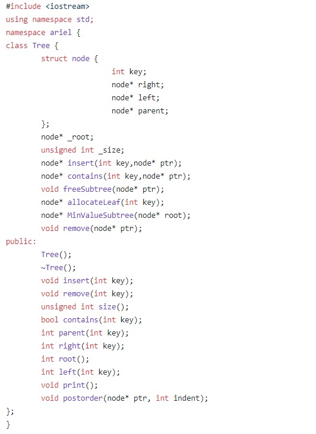

# Binary-Search-Tree

<h1>Binary-Search-Tree
</h1>

Created during a computer CPP course during the second year at Ariel University in the Department of Computer Science, 2019   <strong>Project site:</strong>&nbsp;<a href="https://zvimints.github.io/Binary-Search-Tree/">https://zvimints.github.io/Binary-Search-Tree/</a>  <strong>Made by: </strong><a href="https://github.com/ZviMints">Zvi Mints</a> and <a href="https://github.com/orabu103">Or Abuhazira</a> and <a href="https://github.com/eilon26">Eilon Tsadok</a>

Welcome to the Binary-Search-Tree page! :boom:  

<b>Makefile: </b>Makefile script in order to merge all the files together
 <b>Tree.cpp: </b>Main Source cpp file of the project, include the Tree.hpp
 <b>Tree.hpp: </b>The main Header hpp file of the project, includes declaration of the methods that relevant to the BEST.
 <b>TreeDemo.cpp: </b>Simple Demo that using the BST code.
 <b>TreeTest.cpp: </b>Testing file for BST.

# In this project we create a class of a binary search tree that contains natural numbers.

<h1>Functionality:</h1>  
  

# How to use the tree:

## Insert - in order to insert number into its suitable place in the tree, just use the function insert(your number).
Note: if you insert existing number the function will throw an exception.

## Remove - in order to remove a number from the tree and keep it organized, just use the function remove(your number).
Note: if you remove a  non existing number the function will throw an <b>exception</b>.

## Size - in order to get the amount of the numbers in the tree, just use the function size().

## Contains - in order to know if a number is in the tree, just use the function contains(your_number).

## Root - in order to get the value of the root, just use the function root().
Note: if the tree is empty the function will throw an exception.

## Neighbors - in order to find who is the neighbors of some number that in the tree, just use the functions parent(your_number), left(your_number), right(your_number).
Note: if there is no neighbor as you ask for, the function will throw an exception.

## Print - in order to print the tree, just use the function print().
